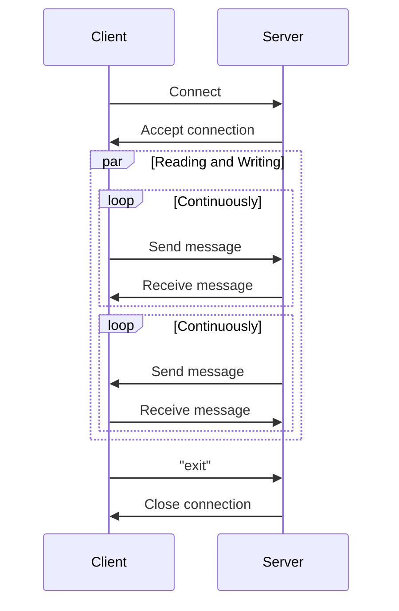

# Java Socket Programming Chat Application


This project demonstrates a simple console based chat application using Java Socket programming. It consists of two main classes: Server.java and Client.java. The server listens for incoming client connections, and both the server and client can send and receive messages.

## Features
- Simple console-based chat application.
- Multi-threaded to handle reading and writing simultaneously.
- Clients can connect to the server and exchange messages.
- Supports multiple clients (though this version handles one client at a time).
- Graceful termination with "exit" command.

## Getting Started
### Prerequisites
- Java Development Kit (JDK) installed on your machine.
- An IDE or text editor of your choice.
### Running the Server
1. Compile the Server.java file:
```sh
javac Server.java
```
2. Run the Server class:
```sh
java Server
```
### Running the Client
1. Compile the Client.java file:
```sh
javac Client.java
```
2. Run the Client class:
```sh
java Client
```

## Code Structure
### Server.java

The `Server` class handles incoming connections and communication with the client. It consists of the following main components:

- **ServerSocket:** Listens for incoming connections.
- **Socket:** Manages the connection with the client.
- **BufferedReader** and **PrintWriter:** For reading from and writing to the socket.

### Main Methods

- **startReading():** A thread to continuously read messages from the client.
- **startWriting():** A thread to continuously send messages to the client.

### Client.java

The `Client` class connects to the server and handles communication. It consists of the following main components:
- **Socket**: Manages the connection with the server.
- **BufferedReader** and **PrintWriter**: For reading from and writing to the socket.

#### Main Methods
- **startReading()**: A thread to continuously read messages from the server.
- **startWriting()**: A thread to continuously send messages to the server.


## Sequence Diagram

Here's a simplified sequence diagram to illustrate the communication flow between the server and client:



## Example Usage

1. Start the server. You should see:
    ```
    This is Server...
    Going to start Server...
    Server is ready to accept connection
    waiting...
    ```

2. Start the client. You should see:
    ```
    This is Client...
    Going to start Client...
    Sending request to server
    Connection Done.
    Reader Started...
    Writer Started...
    ```

3. Type messages in the client console to send them to the server. Type messages in the server console to send them to the client.

4. To terminate the chat, type `exit` in either the client or server console.

## Notes

- The current implementation handles only one client at a time. For multiple clients, consider using a thread pool on the server side.
- Proper exception handling and resource management should be considered for production-ready code.

## Contributing

Contributions are welcome! Please open an issue or submit a pull request for any improvements or bug fixes.